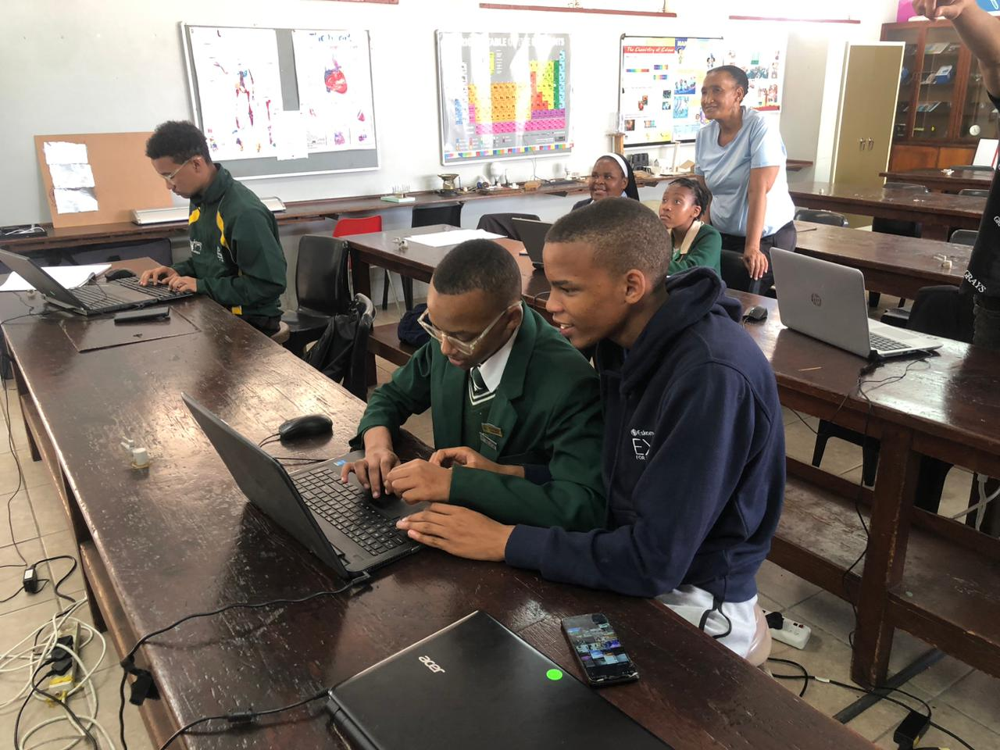
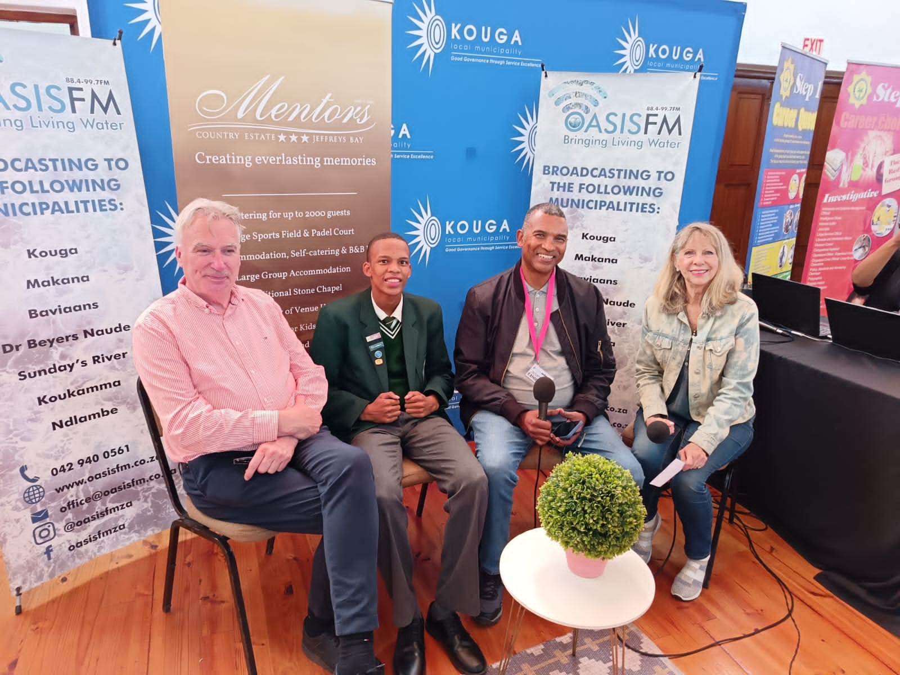

<!DOCTYPE html>
<html lang="en">
<head>
    <meta charset="UTF-8" />
    <meta name="viewport" content="width=device-width, initial-scale=1.0" />
    <meta name="description" content="The professional portfolio for Clyde Snyders, a Grade 9 student from Paterson High School (PHS) specializing in STEM, robotics, and science." />
    <title>Clyde Snyders - Student & Innovator Portfolio</title>
    
    <link rel="preconnect" href="https://fonts.googleapis.com">
    <link rel="preconnect" href="https://fonts.gstatic.com" crossorigin>
    <!-- link to the new modern minimal stylesheet (replaces the big inline style block) -->
    <link rel="stylesheet" href="/assets/css/portfolio-modern.css">
    
    
    

</head>
<body>
    

        

    

<nav class="flex items-center justify-between px-6 py-4 container">
    <a href="#home" class="font-bold text-2xl">Clyde Snyders</a>
    

        <a href="#home" class="nav-link">Home</a>
        <a href="#about" class="nav-link">About</a>
        <a href="#academics" class="nav-link">Academics</a>
        <a href="#achievements" class="nav-link">Achievements</a>
        <a href="#gallery" class="nav-link">Gallery</a>
        <a href="#blog" class="nav-link">Blog</a>
        <a href="#contact" class="nav-link">Contact</a>
    

    <button id="mobile-menu-btn" class="md:hidden btn">Menu</button>
</nav>

<section id="home" class="hero">
    

        <h1>Clyde Snyders</h1>
        
Grade 9 Student | Patterson High School | Eastern Cape

        
Hi, my name is Clyde Snyders and I am a Grade 9 student at Paterson High School in the vibrant Eastern Cape. My journey into the world of STEM wasn't a single moment but a gradual awakening. I started with a small fascination for how things work — taking apart old electronics and trying to put them back together. That 'aha!' moment was because of my patience.

        

            <a href="#about" class="btn">About Me</a>
            <a href="#gallery" class="btn" style="background:#fff;color:var(--accent);border:1px solid var(--border);">Gallery</a>
        

    

</section>

<section id="about" class="card">
    <h2>About Me</h2>
    

        
I am driven, curious, and passionate about science, technology, and growth. My journey into robotics began with a simple fascination for how things work. It grew into building and programming robots, exploring physics, and collaborating on team projects. Whether it's building robots, exploring physics, or collaborating on team projects, I believe every challenge is an opportunity to learn and contribute.

    

</section>

<section id="academics" class="">
    <h2>Academics & Performance</h2>
    

        

            <h3>Gold Medal: Regional Science Expo</h3>
            
2025 — Regional competition for student projects.

            
Awarded a gold medal for a project that demonstrated creative application of science to a community problem.

        

        

            <h3>Bronze Medal: International Science Fair</h3>
            
2024 — Represented local school at international level.

            
Practical participation and strong execution on project delivery.

        

    

</section>

<section id="achievements" class="">
    <h2>Achievements & Awards</h2>
    

        

            <h3>SpirngBots Competition — World</h3>
            
Team-based robotics competition.

            
Contributed to a team that designed and programmed an autonomous robot for a precise task.

        

        

            <h3>Community Projects</h3>
            
STEM outreach and mentorship.

            
Guided younger students through small robotics workshops and coding clubs.

        

    

</section>

<section id="gallery" class="gallery">
    <h2>Gallery</h2>
    

        
        
        
    

</section>

<section id="blog" class="">
    <h2>Blog & Reflections</h2>
    

        

            <h3>Learning by Doing</h3>
            
Aug 2025

            
Hands-on projects have taught me how problems can be approached from many angles. Each iteration leads to an improved solution.

        

    

</section>

<section id="contact" class="card">
    <h2>Contact</h2>
    <form class="contact-form" action="https://formspree.io/f/xgvlvvnn" method="POST">
        <label for="email">Your Email</label>
        <input id="email" name="email" type="email" placeholder="you@example.com" required>
        <label for="message">Message</label>
        <textarea id="message" name="message" rows="5" placeholder="Write a short message"></textarea>
        <button type="submit" class="btn">Send Message</button>
    </form>
</section>

<footer>
    
© 2025 Clyde Snyders — All rights reserved.

</footer>

</body>
</html>
